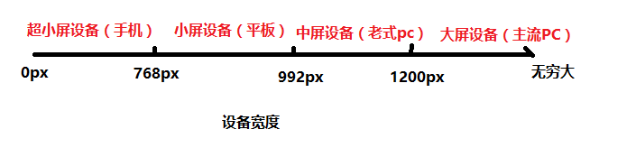
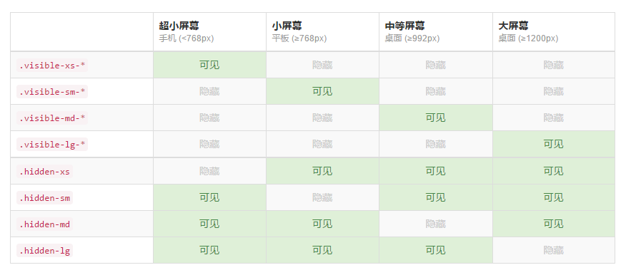

# 移动端布局概述

## REM布局

### rem是什么？

`rem`（font size of the root element）是指相对于根元素的字体大小的单位。它就是一个相对单位。

`em`（font size of the element）是指相对于当前元素的字体大小的单位。它也是一个相对单位。

它们之间其实很相似，只不过计算的规则一个是依赖根元素，一个是当前元素计算。

```css
html{
  font-size:16px;
}
body {
  font-size:20px;
}
div.em {
  /*em的计算方式参照的当前元素的font-size，如果不设置，默认继承自父盒子*/
  width:2em;
  height:2em;
  background-color:red;
}
/*rem的计算方式参照的是html的font-size*/
div.rem {
  width:2rem;
  height:2rem;
  background-color:blue;
}
```


### 为什么要用rem？

> rem的主要目的就是解决用于不同屏幕的适配问题。rem能够等比例的适配所有的屏幕。

由于市面上手机种类繁多，导致移动端的屏幕种类非常的混乱，比如有常见的`320px 360px 375px 384px 480px 640px`等。在开发中，美工一般只会提供750px或者是640px的设计稿，这就要求我们通过一张设计稿能够适配所有的屏幕。通常解决方案如下：

- 流式布局：虽然可以让各种屏幕都适配，但是显示效果不是非常的友好，因为只有几个尺寸的手机能够完美的显示出来视觉设计师和交互最想要的效果。但是目前使用流式布局的公司非常多，比如 [亚马逊](https://www.amazon.cn/) 、[京东](https://m.jd.com/) 、[携程](https://m.ctrip.com/)
- 响应式布局：响应式这种方式在国内很少有大型企业的复杂性的网站在移动端用这种方法去做，主要原因是**工作大，维护性难** 。所以一般都是中小型的门户或者博客类站点会采用响应式的方法从PC端页面到移动端页面以及web app直接一步到位，因为这样反而可以节约成本。
- rem布局：rem能够适配所有的屏幕，与less配合使用效果会更好。目前使用rem布局的有：[淘宝](https://m.taobao.com) 、 [苏宁](https://m.suning.com/)

### rem与响应式

因为rem的基准点是`根元素html的字体大小`，因此我们只需要设置不同屏幕的`html的font-size大小`不一样就可以达到不同屏幕的适配了。 

###  rem与媒体查询

使用rem配合媒体查询可以适配多个终端

```css
/*
	媒体查询从小往大写，符合条件的会覆盖前面生效的
	640的屏幕， 分成16份  16rem  1rem = 40px
	将要适配的所有屏幕都分成固定份数，计算出html的大小，
	用rem来替换页面元素的px
*/
    @media (min-width: 320px) {
      html {
        font-size: 20px;
      }
    }

    @media (min-width: 480px) {
      html {
        font-size: 30px;
      }
    }

    @media (min-width: 640px) {
      html {
        font-size: 40px;
      }
    }


/*页面元素使用rem布局*/
    div {
      width: 4rem;
      height: 4rem;
      font-size: 0.8rem;
      background-color: pink;
    }

```

优点：使用媒体查询适配，速度快。

缺点：适配多个终端时，需要添加响应的代码。

### rem与javascript

- 通过javascript获取可视区的宽度，计算font-size的值，也可以适配多个终端。
- 一般不会这么做

```javascript
function responsive() {
  var uiWidth = 750;//设计图宽度
  var fontSize = 50;//设计图中1rem的大小
  //当前屏幕的大小
  var pageWidth = window.innerWidth;
  if(pageWidth >= 750) {
    pageWidth = 750;
  }
  if(pageWidth <= 320) {
    pageWidth = 320;
  }
  //说白了就是把一个屏幕分成了15rem
  document.documentElement.style.fontSize = (50/750 * pageWidth).toFixed(2) + "px";
}
```

优点：直接适配所有的终端

缺点：必须在页面加载之前设置html的font-size值，不然会出现文字大小跳动的情况。

### 使用rem布局的套路

>  按顺序来

1. 引入normalize.less
2. 确定要适配屏幕的大小，将屏幕分成多少份
3. 编写媒体查询less，比如750屏分15份，html字体大小就是50px

```less
@charset "UTF-8";
//适配不同屏幕，，，，确定设计图的大小。750， 商量好：设计图分成15份， 1rem = 50px
//320 360 375 384 400 414 424 480  484 540 720 750
.adapter(@deviceWidth){
  @media (min-width: @deviceWidth) {
    html {
      font-size: round(@deviceWidth/15, 2);
    }
  }
}

.adapter(320px);
.adapter(360px);
.adapter(375px);
.adapter(384px);
.adapter(400px);
.adapter(414px);
.adapter(424px);
.adapter(480px);
.adapter(540px);
.adapter(720px);
.adapter(750px);
```

4. 开始写base.less。
5. 在需要如上样式的页面使用@import引入
6. 版心是不需要rem布局的

```less
.container {
  width: 100%;
  max-width: 750px;
  min-width: 320px;
  background-color: yellowgreen;
  margin: 0 auto;
}
```

7. 其余元素全都使用rem替换px进行布局
   - 除去的是最大屏幕设置的html字体大小

```less
  .category,
  .cart {
    width: 90rem/50;
    //和使用px一样，只是替换成rem并除去html字体的大小
    height: 90rem/50;
    position: absolute;
    top: 0;
  }
```

## 流式布局

**移动端的特点**

- 手机端的兼容性问题比PC端小很多，因为手机端的浏览器版本比较新
- 手机端屏幕比较小，能够放的内容比较少。

问题：布局的时候怎么解决屏幕大小不一致的问题？

- PC端，固定版心，让所有分辨率的电脑的版心都是一样的，比如京东
- 移动端：移动端无法设置版心，因为移动端的设备屏幕本身就小，设置版心不合适。因此移动端大多会采用**流式布局**（百分比布局）


**流式布局**，也叫百分比布局，是移动端开发中经常使用的布局方式之一。

流式布局的特征：

- 宽度自适应，高度写死，并不是百分百还原设计图
- 图标都是固定死大小的，包括字体等也是固定死的。`并不是所有的东西都是自适应的`。
- 一些大的图片，设置宽度为百分比自适应即可，随着屏幕大小进行变化

**流式布局无法做到所有设备都非常逼真的还原设计图，有些设备显示效果不是特别的好看。但是流式布局是移动端非常常用的一种布局方式，比较简单，需要掌握（携程、京东)**

#### 经典的流式布局

1. 左侧固定，右侧自适应

```css
    .box {
      height: 100px;
      width: 100%;
      background-color: green;
      position: relative;
    }
//固定宽高的盒子定位或者浮动
    .left {
      width: 100px;
      height: 100px;
      background-color: red;
      position: absolute;
      top: 0;
      left: 0;
    }
//自适应的盒子留margin
    .right {
      height: 100px;
      background-color: blue;
      margin-left: 100px;
      //ml的大小和固定盒子的宽度一样
    }
```

2. 右侧固定，左侧自适应(与上面同理)
3. 两侧固定，中间自适应（圣杯布局，双飞翼布局）

```css
    .box {
      width: 100%;
      height: 100px;
      background-color: green;
      position: relative;
    }
//左右都给固定宽高，定位或者浮动
    .left,
    .right{
      width: 100px;
      height: 100px;
      position: absolute;
      top: 0;
      background-color: blue;
    }

    .left {
      left: 0;
    }
    .right {
      right: 0;
    }
//中间的盒子左右给margin，不给宽。
    .center {
      margin: 0 110px;
      background-color: yellow;
      height: 100px;
    }
```

4. 等分布局

```css
    * {
      margin: 0;
      padding: 0;
      list-style: none;
    }

    ul {
      width: 100%;
    }
    li {
      float: left;
      //都是百分比
      width: 20%;
      height: 100px;
      border: 1px solid #000;
      box-sizing: border-box;
    }
```

- 流式布局的套路基本如上

## 响应式布局

### 什么是响应式布局

> 响应式布局（respond layout）是Ethan Marcotte在2010年5月份提出的一个概念，简而言之，就是**一个网站能够兼容多个终端** ——而不是为每个终端做一个特定的版本。这个概念是为解决移动互联网浏览而诞生的。


**为什么要有响应式布局？** 

- 在移动互联日益成熟的时候，在PC端开发的网页已经无法满足移动设备的要求。
- 通常的做法是针对移动端单独做一套特定的版本。
- 如果终端越来越多，那么需要开发的版本就会越来越多（大屏设备的普及）
- **响应式布局** ：一个网站能够兼容多个终端（节约开发成本）

**优点：** 

面对不同分辨率设备灵活性强

能够快捷解决多设备显示适应问题

**缺点： **

兼容各种设备工作量大，效率低下

代码累赘，会出现隐藏无用的元素，加载时间加长

其实这是一种折中性质的设计解决方案，多方面因素影响而达不到最佳效果

一定程度上改变了网站原有的布局结构，会出现用户混淆的情况


响应式开发现状：

- 如果已经存在PC的网站了，那么一般不会使用响应式开发，而是针对移动端再开发一套系统（比如京东、淘宝）
- 在**新建站点** 上采用响应式开发的越来越多。
- 在国内，响应式开发还不是特别的流行。但响应式开发是大势所趋，会越来越流行。

## 响应式开发与移动web开发的比较

| 开发方式 | 移动web开发+pc开发               | 响应式开发              |
| ---- | -------------------------- | ------------------ |
| 引用场景 | 一般已经有了PC端网站，只需要端独开发移动端网站即可 | 针对一些新建网站，并且要求适配移动端 |
| 开发   | 针对性强，开发效率高                 | 兼容各种终端，效率低         |
| 适配   | 只能适配移动端或者PC端，pad上体验比较差     | 可以适配各种终端           |
| 效率   | 代码简洁，加载快                   | 代码相对复杂，加载慢         |

> 思考：响应式开发的原理是什么？

# 媒体查询

> 媒体查询（Media Query）是CSS提出来的一个新的属性，通过媒体查询可以查询到screen的宽度，从而指定某个宽度区间的网页布局。

## 设备分类

| 分类    | 宽度范围         |
| ----- | ------------ |
| 大屏设备  | >1200px      |
| 中屏设备  | 992px~1200px |
| 小屏设备  | 768px~992px  |
| 超小屏设备 | < 768px      |





## 媒体查询的使用

需求：

```html
<!--
需求：
    大屏设备(>1200px)   版心：1170px   背景色：红色
    中屏设备(992-1200)  版心：970px    背景色：蓝色
    小屏设备(768-992)   版心：750px    背景色：黄色
    超小屏设备(<768px)  版心：100%     背景色：绿色
-->
```

**响应式开发的原理：使用媒体查询实现不同终端的布局和样式的切换。**

媒体查询语法：

```css
/*查询屏幕*/
@media screen and 条件 {
}

/*条件的写法*/
/*min-width:只要屏幕宽度超过这个值的设备样式就能生效*/
/*max-width:只要屏幕宽度小于这个值的设备样式就能生效*/
@media screen and (min-width: 1200px) {
  .container {
    width: 1170px;
    background-color: red;
  }
}

@media screen and (min-width: 992px) and (max-width: 1200px) {
  .container {
    width: 970px;
    background-color: blue;
  }
}

@media screen and (min-width: 768px) and (max-width: 992px) {
  .container {
    width: 750px;
    background-color: yellow;
  }
}

@media screen and (max-width: 768px) {
  .container {
    width: 100%;
    background-color: green;
  }
}
```

**弊端：现在只有一个div，要做一套响应式布局，就需要如此多的代码，非常的麻烦，因此我们会更多的借助一些响应式的框架，比如bootstrap。**

# bootstrap框架

> Bootstrap，来自 Twitter，是目前很受欢迎的前端框架。Bootstrap 是基于 HTML、CSS、JAVASCRIPT 的，它简洁灵活，使得 Web 开发更加快捷。

[bootstrap中文网](http://www.bootcss.com/)

特点：

- 组件简洁大方、代码规范精简、界面自定义性强。
- ​Bootstrap是基于HTML5和CSS3开发的，它在jQuery的基础上进行了更为个性化和人性化的完善，形成一套自己独有的网站风格，并兼容大部分jQuery插件。
- ​Bootstrap中包含了丰富的Web组件，根据这些组件，可以快速的搭建一个漂亮、功能完备的网站。

优点：

- 有自己的生态圈，不断的更新迭代
- 提供了一套简洁、直观、强悍的组件
- 标准化的HTML+CSS编码规范
- 让开发更简单，提高了开发效率。
- 扩展性强，虽然界面组件样式已经定义好了，我们还可以自定义，修改默认样式。

版本：

- 2.x.x 停止维护
  - 优点：兼容性好
  - 缺点：代码不够简洁、功能不够完善
- 3.x.x **目前使用最多**
  - 优点：稳定，偏向于开发响应式布局，移动设备优先的WEB项目
  - 缺点：放弃了IE67，对IE8支持但是界面效果不友好
- 4.x.x 测试阶段 (目前国外已发布正式版本)

## 基本模板

目录结构说明


```html
<!DOCTYPE html>
<!--使用HTML5文档，使用中文简体-->
<html lang="zh-CN">
<head>
  <!--meta1. 使用utf-8编码-->
  <meta charset="utf-8">
  <!--meta2. 当前页面在在IE浏览器访问时，使用最新的ie浏览器内核进行渲染-->
  <meta http-equiv="X-UA-Compatible" content="IE=edge">
  <!--meta3. 视口设置-->
  <meta name="viewport" content="width=device-width, initial-scale=1, user-scalable=no">
  <!-- 上述3个meta标签*必须*放在最前面，任何其他内容都必须跟随其后！ -->
  <title>bootstrap基本模板</title>
  
  <!--引入bootstrap的核心样式文件-->
  <link href="lib/bootstrap/css/bootstrap.min.css" rel="stylesheet">
  
  <!-- html5shiv是用来解决IE8以下浏览器不支持HTML5语义化标签的问题 -->
  <!--respond是用来解决IE8以下浏览器不支持媒体查询的问题，注意：respond不支持file协议打开-->
  <!--条件注释：IE浏览器专属-->
  <!--[if lt IE 9]>
  <script src="lib/html5shiv/html5shiv.min.js"></script>
  <script src="http://cdn.bootcss.com/respond.js/1.4.2/respond.min.js"></script>
  <![endif]-->
</head>
<body>
<h1>你好，世界！</h1>

<!--bootstrap依赖与jquery，因此需要在bootstrap之前引入jquery文件-->
<script src="lib/jquery/jquery-1.12.4.js"></script>
<!--引入bootstrap的核心js文件-->
<script src="lib/bootstrap/js/bootstrap.min.js"></script>
</body>
</html>
```

## 全局样式

### normalize.css

> Normalize.css是一种CSS reset的替代方案。

[官网](http://necolas.github.io/normalize.css/)

[github网址](https://github.com/necolas/normalize.css)

normalize的特点：

- **保护有用的浏览器默认样式**而不是完全去掉它们
- **一般化的样式**：为大部分HTML元素提供
- **修复浏览器自身的bug**并保证各浏览器的一致性
- **优化CSS可用性**：用一些小技巧

**`Normalize.css`支持包括手机浏览器在内的超多浏览器，同时对HTML5元素、排版、列表、嵌入的内容、表单和表格都进行了一般化。尽管这个项目基于一般化的原则，但我们还是在合适的地方使用了更实用的默认值。**

[Normalize.css与CSS reset区别](http://www.cnblogs.com/webpush/p/4974063.html)

### container容器

Bootstrap 需要为页面内容和栅格系统包裹一个 .container 容器。默认带了15px的padding值。

`.container` 类用于固定宽度并支持响应式布局的容器。

```html
<div class="container">
  ...
</div>
```

`.container-fluid` 类用于 100% 宽度**流式布局**，占据全部视口（viewport）的容器。

```html
<div class="container-fluid">
  ...
</div>
```

**这两种 容器类不能互相嵌套。** 

### 栅格系统

栅格系统，也叫网格系统

- `.row`用于抵消`.container`容器的15px的padding值
- 可以在`.row`中嵌套`column`

栅格系统常用类（总共12列）

| 类名         | 例子        | 解释           |
| ---------- | --------- | ------------ |
| .col-xs-xx | .col-xs-6 | 在超小屏幕（及以上）生效 |
| .col-sm-xx | .col-sm-6 | 在小屏幕（及以上）生效  |
| .col-md-xx | .col-md-6 | 在中屏幕（及以上）生效  |
| .col-lg-xx | .col-lg-3 | 在大屏幕及生效，占1/4 |
| .col-lg-xx | .col-lg-4 | 在大屏幕及生效，占1/3 |
| .col-lg-xx | .col-lg-5 | 在大屏幕及生效，占1/2 |

【案例：响应式栅格系统】

```html
<!--
需求：
  1. 在大屏时显示6个等分的列
  2. 在中屏时显示4个等分的列
  3. 在小屏时显示3个等分的列
  4. 在超小屏时显示2个等分的列
-->
```

【案例：列嵌套.html】

```html
<div class="col-lg-4">
      <!--栅格系统无处不在，只要父盒子有宽度，就可以使用栅格系统-->
      <div class="row">
        <div class="col-lg-6"></div>
        <div class="col-lg-6"></div>
      </div>
    </div>
```

【案例：列偏移.html】

```html
<!-- 使用 .col-md-offset-* 类可以将列向右侧偏移。-->
<div class="row">
  <div class="col-lg-3"></div>
  <!--col-lg-offset-3:在大屏下，这个div将向右侧偏移3个单位-->
  <div class="col-lg-6 col-lg-offset-3"></div>
</div>
```


【案例：列排序.html】

```html
<div class="row">
  <!--col-lg-push-9:往后推9格-->
  <!--col-lg-pull-3:往前拉3格-->
  <div class="col-lg-3 col-lg-push-9"></div>
  <div class="col-lg-9 col-lg-pull-3"></div>
</div>
```


### 响应式工具

```javascript
//1. 大屏显示
//2. 中屏不显示
//3. 小屏显示
//4. 超小屏不显示
```



**推荐使用hidden相关的属性**

- 引入图标

```html
<link rel="icon" href="favicon.ico" type="image/x-icon" />
```

## 自定义字体图标

**1.定义font-family**

```css
@font-face {
  font-family: 'wjs_fonts';
  src: url('../fonts/MiFie-Web-Font.eot'); /* IE9*/
  src: url('../fonts/MiFie-Web-Font.eot#iefix') format('embedded-opentype'), /* IE6-IE8 */
  url('../fonts/MiFie-Web-Font.woff') format('woff'), /* chrome, firefox */
  url('../fonts/MiFie-Web-Font.ttf') format('truetype'), /* chrome, firefox, opera, Safari, Android, iOS 4.2+*/
  url('../fonts/MiFie-Web-Font.svg#iconfont') format('svg'); /* iOS 4.1- */
}
```

**2.定义icon类**

```css
.wjs_icon {
  font-family: 'wjs_fonts';
}
```

**3.使用伪元素定义对应的图标类**

```css
.wjs_icon_phone::before {
  content: "\e908";
}

.wjs_icon_tel::before {
  content: "\e909";
}
```

**4.使用字体图标**

```html
<i class="wjs_icon wjs_icon_phone"></i>
```

#### font awsome

- 如果公司没有自己设计图标，可以用fa的图标