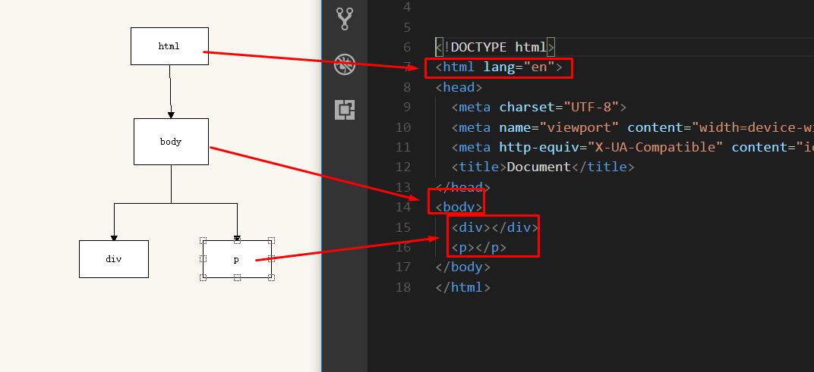
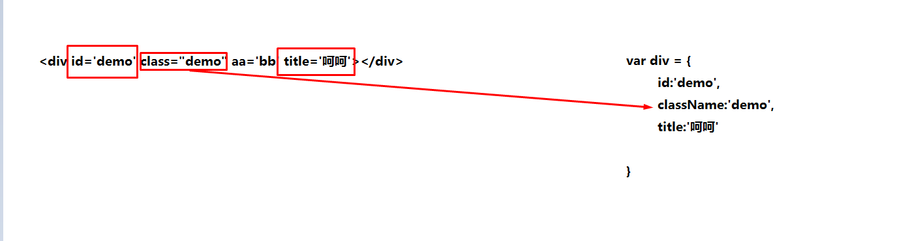

# jQuery中attr和prop的区别

## dom和文档的关系



- 文档就是写的html结构
- dom就是文档对象模型，为了方便操作文档而生，和文档一一对应
- 文档对象具有属性和方法，使用js操作某个元素，咋一看像是操作html，其实是操作文档对象模型。

### 标签的属性，会像对象那样储存在dom中



> 所以我们才能通过`obj.id`、 `obj.title`来操作该元素的id.
>
> class在js中是关键字所以要用className来操作，这些都是标准的属性
>

-  **不是直接操作属性，而是操作对应的dom对象**
### 如何操作自己定义的属性？
-  aa这个属性是不会存在dom对象中的
-  这类属性不会跟id，class那一类存储在一起
-  而是通过get/setAttribute操作
-  **这个操作的就直接是标签了**

```js
//所以你会发现如果用getAttribute获取class，写的直接就是class而不是className
obj.getAttribute('class');
//因为这个方法访问的就是原来的标签
```

## 关于h5的dataset

- 其实就是对dom对象的一个拓展
- 将把data- 开头的属性都存在了dataset里面
- 所以你就可以这样用了 `obj.dataset.xxx`

> 你大可用`setAttribute('disabled','disabled')`来操作按钮
>
> 但如果这样只是改了标签的
>
> 只有通过obj.disabled = 'xxx'才是真正改变dom对象

- 那么就有总结了
- `$('obj').attr()` 底层用的是getAttribute方法
- `$('obj').prop()` 底层用的是dom对象
- 所以在jq中最好用prop的方法来操作disable这一类的属性