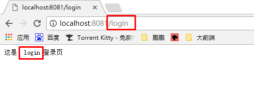
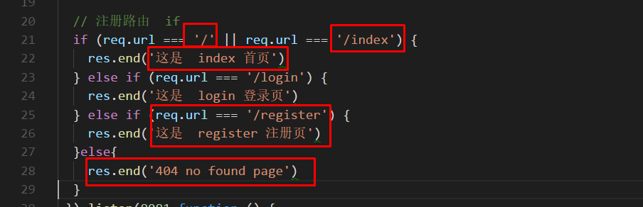
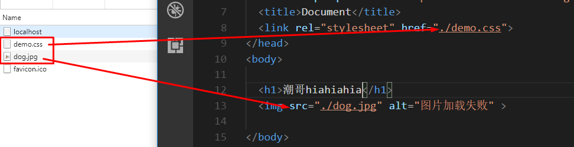

# NoedJs常用API

- 可以使用ECMAscript中的所有api
- 原生js的dom和bom不可使用
- 除了原生ECMAscript的api，node还内置了一层api
- 第三方（npm）拓展的其他api

> 所以可以使用的有：ECMAscript、内置、第三方api

### 执行方法（通过命令行shell、bash都可以）

> node + 文件名

```bash
node server.js
# 执行成功
```


## 读取写入操作

### 读取文件

- fs模块就是内置api，直接通过require导入模块使用
- `fs.readFile(地址,字符集,回调函数(err,data){})`   查看一个文件的方法

```js
//加载一个模块
var fs = require('fs');//
//读取文件  比如要看1.txt
fs.readFile('./1.txt','utf-8',function(err,data){
  //一般有错都要报一下错
  if(err) {
    throw err;
  }
  //这个就是1.txt的文件内容
  console.log(data)
})
```

- 其中，data是一个二进制数组（buffer），有两个方法可以转成人话
  1. 设置第二个参数，字符集编码为utf8
  2. 将data.toString('utf-8')

### 写入文件

- 同样是fs模块的api，`writeFile`
- `fs.writeFile(路径,传输的内容，回调(err){})`

```js
//先定义个内容
var str = '像我这么优秀的人';
fs.writeFile('./1.txt',str,function(err){
  if(err) {
    throw err;
  }
  console.log('看到我就是写入成功');
})
```

- 以上都是异步操作

## 同步读取文件（较少用）

> 和异步写入的区别:
>
> 拿到文件内容的方法不一样
>
> 提示错误的方法不一样

```js
//同样是fs模块的方法
var data  = fs.readFileSync('./1.txt','utf8');
//返回值就是文件内容
```

- 提示错误需要用到try，catch

```js
try {

  var data = fs.readFileSync('./data1.txt','utf8');
  
  console.log(data);

}catch(err){

  console.log('出错了',err)

}
```

## 魔术常量和path模块

- 都是关于路径操作的模块
- `__dirname`和`path.join()`

```js
//__dirname就像php的魔术常量，保存的是当前文件的绝对路径
//path模块一般都用join来和__dirname配合使用
fs.readFile(path.join(__dirname,'./1.txt'),'utf8',function(err,data){
  //path.join(__dirname,'./1.txt') 组合成了当前的路径，保证不会错了
})
```

## http模块，开启服务器

- 这里给的是简写版，非简写版的麻烦。
- 效果一样

> `http.createServer`,`listen`,`setHeader`，`end`
>
> http.createServer(请求，响应)()

```js
//1. 加载 http 模块
var http = require('http');
//2. 创建服务器  开启服务器  开启监听 
 http.createServer(function (req,res) {
   //设置相应头，防止乱码
    res.setHeader('content-type','text/html;charset=utf-8')
    res.end()
})//开始监听8080端口
   .listen(8080,function () {
  console.log('服务器开启了, http://localhost:8080');
})
```

## 路由实现

> 路由就是通过地址栏不同url，响应不同的页面内容。



- 跟返回一个完整页面概念是不同的
- 只是返回内容，并不是去找某个文件显示
- 通过`http.createServer(req,res)`中的req参数的url方法



```js
 var http = require('http');
 http.createServer(function (req,res) {
  // 设置响应头
  res.setHeader('content-type','text/plain;charset=utf-8');
  // 注册路由  if
  if (req.url === '/' || req.url === '/index') {
    res.end('这是  index 首页')
  } else if (req.url === '/login') {
    res.end('这是  login 登录页')
  } else if (req.url === '/register') {
    res.end('这是  register 注册页')
  }else{
    res.end('404 no found page')
  }
 }).listen(8081,function () {
   console.log('服务器开启了,小姐姐们过来玩啊  http://localhost:8081')
 })
```

### 根据路由返回文件

> 能够返回文件才是路由的根本价值
>
> 其实就是配合查找文件，将data`res.end`到页面上，这是一套组合拳。

```js
  if (req.url === '/' || req.url === '/index') {
    //1. 找文件 
    fs.readFile(path.join(__dirname, './htmls/index.html'), function (err, data) {
      if (err) {
        throw err
      }
      //2. 结束响应 响应给浏览器
      res.end(data);
    })
  }
```

### 返回静态资源

> 静态资源一般不是通过url路径，而是某个html页面有对css、图片请求才会发送。
>
> 潜台词就是说，页面的每个请求你都要处理



- 通过`res.setHeader('content-type','文件类型')`解析文件的请求

```js
  else if (req.url === '/demo.css') {
    //1. 设置请求头
    res.setHeader('content-type','text/css')
    //2. 读取
    fs.readFile(path.join(__dirname,'./demo.css'),function (err,data) {
      if (err) {
        throw err
      }
      //3. 结束响应
      res.end(data)
    })
  }
//图片请求
  else if (req.url === '/dog.jpg') {
    res.setHeader('content-type','image/jpeg')
    fs.readFile(path.join(__dirname,'./dog.jpg'),function (err,data) {
            if (err) {
              throw err
            }
            res.end(data)
          })
  }
```

- 那么问题来了

> 1. 每个静态资源都要这么解析？
> 2. 每个类型都要自己设置?

- 解决方法

> 1. 将静态资源都放到同一个文件夹中(public)，通过`startsWith`路由判断文件
> 2. 有个第三方模块`mime`，可以解析文件的类型
> 3.  `req.url`可以拿到请求文件的路径

- 通过`npm i mime -S`下载mime
- 引入mime 模块

```js
var mime = require('mime');
//1.首先，改造路由判断
else if (req.url.startsWith('/public')){
  //通过mime的getType方法设置响应头
  res.setHeader('content-type',mime.getType(req.url))
  //2. 通过req,url写文件路径
  fs.readFile(path.join(__dirname,req.url),function(err,data){
      if (err) {
        throw err
      }
      res.end(data)
    })
}
```

## res和req常用方法

>  req.method

```js
var http = require('http')
http.createServer(function(req, res) {
    if (req.url === '/') {
      //设置响应头
        res.setHeader('content-type', 'text/plain')
      //设置状态码
        res.statusCode = 202;
      //设置状态信息
        res.statusMessage = 'Accepted';
        //结束响应
        res.end('ok')
    } else {
        res.end('404')
    }
}).listen(8080);
```

## url&querystring

- 第三方模块，用于处理搜索栏的参数
- url，看到这样的`/add?title=zzc&url=ccc&text=xx`就用url。（常用于get请求）
- querystring（常用于post）

```js
//比如从req.url拿到/add?title=zzc&url=ccc&text=xx带参数的url
//想要获取title=zzc这样的数组就用url.parse方法。
var URL = require('url');//为了区分页面中的url，所以变量写成大写的
var address = '/add?title=zzc&url=ccc&text=xx';
var urlObj = URL.parse(address, true);//传了true才解析成数组，写的时候自动给一个好了

//post请求过来一般是不带?的键值对字符串
//title=zzc&url=ccc
//这时候就用querystring.parse
var str = 'title=zzc&url=ccc&text=xx';
querystring.parse(str)
```

## underscore

> npm提供的模版引擎，和artTemplate不同
>
> 当写nodejs的时候用`underscore`，写前端就用`artTemplate`

- 安装

`npm i underscore -S`

- 使用

```js
//官方说变量名用_，好那就这样吧.
//1. 引入模块
var _ = require('underscore');

//2. 准备一个带有模版写法的html字符串
var oldHtml = '<h1><%= name %></h1>';

//3. 调用_.template()生成一个模版函数
var fn = _.template(oldHtml);

//4. 用新的模板接收，并传入模版中需要的参数
var newHTML = fn({
  name:'zzc'
})
console.log(newHtml); //<h1>zzc</h1>
```

- 实例

> 配合读取文件，返回内容到页面

```html
-----index.html
<ul>
    <% for ( var i = 0; i < list.length ; i++)  { %>
		<!--模板里要一个list-->
      <li>哈哈 <%= list[i] %>  </li>

    <%  } %>
  </ul>
```

> 以下是一个完整的路由思路
>
> 通过url判断路由，读取对应的html文件
>
> 再通过模板引擎解析好有数据的新html文件给前台

```js
//1. 加载  underscore以及其他模块
var _ = require('underscore');
var http = require('.http');
var  fs = require('fs');
var path = require('path');

http.createServer(function(req,res){
  if(res.url == '/index') {
    fs.readFile(path.join(__dirname,'./index.html'),'utf8',function (err,data) {
    if (err) {
      throw err
    }
    // 拿到老html字符串
  	var  oldHtml = data;
    
    // 调用模版函数解析
  	var fn =  _.template(oldHtml);
    
    //这条数据是模拟的
  	var  list = [1,2,3];
  	
    //生成了新的html字符串
    var newHtml =   fn({ list:list });
    
    //把新的html字符串响应到页面
    res.end(newHtml);
    })
  }
}).listen(8080);
```


