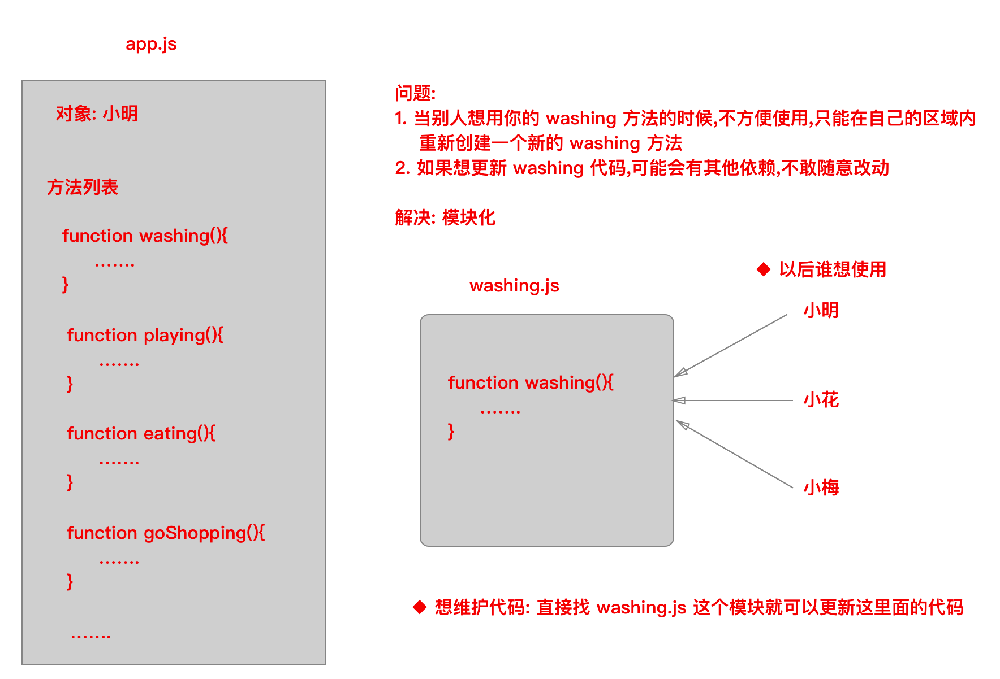
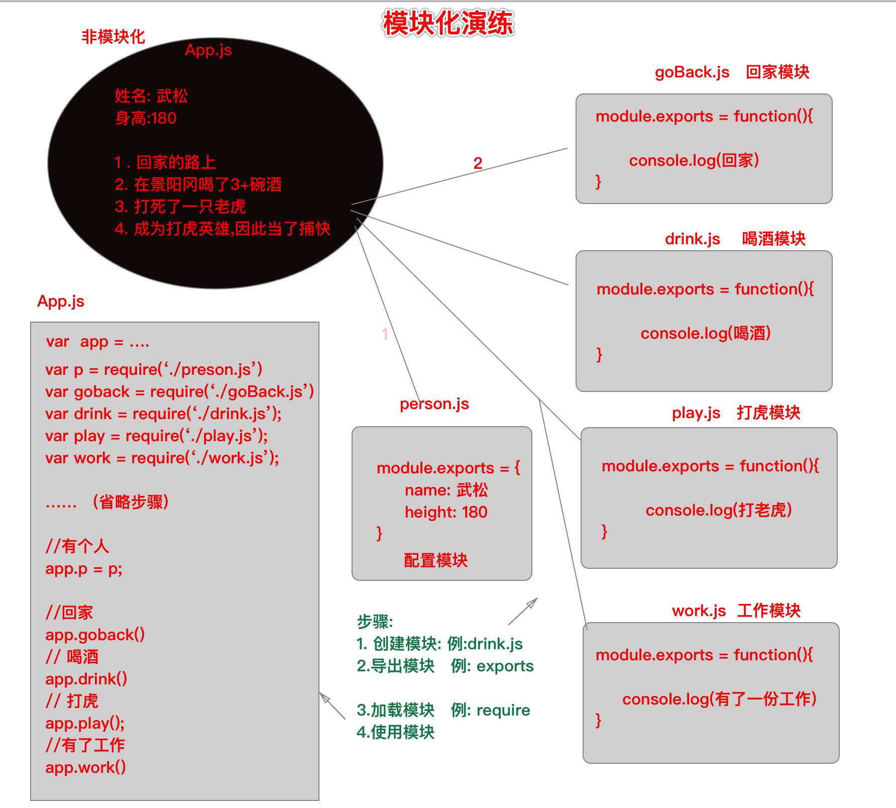

# 模块化开发

1. ##### 什么是模块化开发?

   - 简单的说就是: 我们实现一个应用,通常都会按照不同的功能,分割成不同的模块来编写,编写完之后,按照某种方式组装起来成为一个整体,最终实现整个系统的功能。
   - 再再简单的一句话就是: `把不同的功能,放到不同的模块里(.js)编写`
   - 可以理解为一个个沙箱，以前是通过script标签src引入的.现在可以在js文件中引入。

2. ##### 为什么要进行模块化?

- 便于多人合作开发 ;
- 便于后期代码的维护 ; 



##### 3.  怎么进行模块化?



★ 步骤

> 时刻记住模块化的四个步骤:
>
> 1.创建模块(router.js),
>
>  2.导出模块(module.exports),
>
> 3.加载模块(require),
>
> 4.使用模块

##### ★ 时刻记住如何编写模块:

> 1. 当前模块要写什么内容?      ——> 就是js逻辑
> 2. 这些代码是否用到外部的数据? ——> 函数的参数，如果需要应该返回一个函数
> 3. 是否依赖第三方模块、内置模块、文件模块和一起自定义方法 ——>要不要在模块内部引包

- 例子

```js
//原文件中的判断路由方法
http.createServer(function (req, res) {
  //下面就是要抽取的部分
	if (req.url === '/' || req.url === '/index') {
		res.end('this is index');
	}
}
```

- 需求：抽取出来方法到文件操作模块

> 思路:
>
> 1. 将代码复制过来，放到module.export中
> 2. 看是否需要参数，如果是就将module.export改造成返回函数的样子
> 3. 有没有用到其他模块的东西，如果有，要引入

```js
// router.js  文件模块
//由于有用到req和res参数，所以要module.exports要导出一个函数
//由于路由一般都有很多个，所以分别添加属性导出不同的路由
module.exports.index = function(req,res){
  if (req.url === '/' || req.url === '/index') {
		res.end('this is index');
	}
}
```

- 改造后的源文件

```js
//引入router模块
var router = require('./router')//以导入文件的写法导入
http.createServer(function (req, res) {
  //下面就是要抽取的部分
	router.index(req,res);
}
```

> 如果你的代码中有用到其他模块的东西，需要在自己的模块中引入。
>
> 因为其他文件调用你的模块，会去定义模块的js文件找。

###  