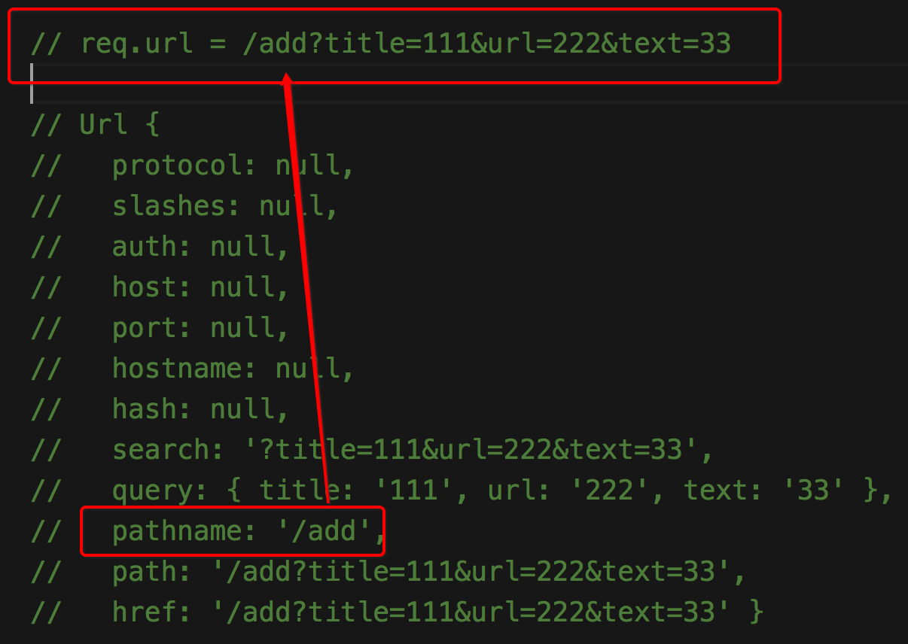
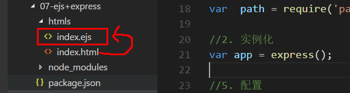

# Express

## 什么 express?

-  Express 是nodejs的jquery。
-  是 `Node.js` 的一个 第三方模块。

- 为什么学习 express 框架?
  - 想想干嘛学jquery
- express 官方网站
  - [英文官网 - http://expressjs.com/](http://expressjs.com/)
  - [中文官网 - http://www.expressjs.com.cn/](http://www.expressjs.com.cn/)

#### Express 特点  

> 先了解,知道个概念,,后面会细讲

1. 实现了`路由`功能   (eg: express.Router())
2. `中间件`（函数）功能;  (eg. App.use('/',function{ … }))、  配合 use 一块使用
3. 对` req 和 res` 对象的`扩展`
4. 可以集成其他`模板引擎` (eg: ejs )


###★ Express 基本使用

##### 1. 基本步骤

- 安装:   `npm i express -S`        // 安装之前: 先`npm init -y` 初始化 package.json 文件
- 加载:   `var express = require('express')`
- 实例:   `var app = express()`      // 实例化 express 对象
- 使用:   ` app.get()/app.use()/app.all() …. App.listen()`

##### 2. 演示 Hello World 案例

```js
//1. 加载express
var express = require('express');

//2. 实例
var app = express();   //  (类似于创建一个 server 对象)

//3. 使用
// 参数1: 路径
// 参数2: 回调函数
app.get('/',function (req,res) {
  res.end('Hello world')
})

// 开启服务器
app.listen(8080,function () {
  console.log('服务器开启了 http://localhost:8080')
})

```

##### 3.  res.send() 和 res.end() 的异同 ? 

- 相同点: 都能够结束响应,把内容响应给浏览器

- 不同点: 

  - 1. send () 不乱码:

    ```js
    res.send() 会自动发送更多的响应报文头,其中就包括: Content-Type:text/html; charset=utf-8 所以没有乱码;
    ```

  - 2. 参数类型不同:

    ```js
    - res.send() 参数可以是 a Buffer object、a String , 还有 an object、an Array
    - res.end() 参数类型只能是: Buffer 或者 String 
    ```

- 总结: 以后在 express 推荐使用: `send() ` 发送HTTP响应;


**4.  res 的其他几个常用的方法**

-  **res.redirect([status,] path) : 重定向**

  ```js
    res.redirect('https://www.baidu.com');
    res.redirect(301, 'https://www.baidu.com');
  ```

- **res.sendFile(path [, options]_[, fn])  读取文件**

  ```js
  // 以前 : 读取文件并响应
    fs.readFile(path.join(__dirname,'./index.html'),function (err,data) {
      if (err) {
        throw err
      }
      res.end(data);
    })

  // 现在 : 
  // 2.1 不需要回调函数
  res.sendFile(path.join(__dirname,'./demo.html'))
  // 2.2 需要回调函数
  res.sendFile(path.join(__dirname,'./demo.html'),function (err) {
      if (err) {
        throw err
      }
      console.log('ok')
    })
  ```

- **res.status() : 设置状态** 

  ```js
   res.status(404).send('文件不存在！');
  ```


###★ Express 中注册路由的方法

#####方法一 :  app.METHOD

> 这不是一个api，说的是get，post，put，delete都称为method方式
>
> 效果：固定类型,路径完全匹配

​	**1. 基本用法**

- ```js
  1. 请求方式固定
  2. 路径完全匹配
  ```

  ```js
  // 参数1: 路径
  // 参数2: callback 回调  
  app.get('/index',function (req,res) {
    
      res.send('index')
  })
  ```

  

  ​

#####方法二 :   app.use()

> 开头是: /index 就匹配
>
> **任意类型**,路径开始相同就匹配

- 1. 在进行路由匹配的时候,不限定方法,`什么请求方法`都可以 
- 2. 请求路径的`第一部分`只要与 /index 相等即可,并不要求请求路径 ( pathname ) 完全匹配

```js
app.use('/index',function (req,res) {
  res.send('hello 你好世界')
})
```

##### 方法三 : app.all()  

> 任意类型, 路径完全匹配

- 1. 不限定请求方法;
  2. 请求路径的 pathname 必须完全匹配;

  ```js
  app.all('/index',function () {
    res.send('index');
  })
  ```


###★ Express 处理静态资源

1. app.use的写法:

   > 是不是想当然的觉得用ues就可以匹配以文件名开头的静态资源了？
   >
   > too 羊 too 奈舞

   ```js
   // 注册路由
   // 处理静态资源
   app.use('/public',function(req,res){
     res.sendFile(path.join(__dirname,'./public/demo.css'));
   })
   ```

   ​

2. #####使用 express 的内置模块   [express.static](http://www.expressjs.com.cn/starter/static-files.html)

   > 作为一个长者推荐你使用`中间件`

   ```js
   //官网原话:
   通过 Express 内置的 express.static 可以方便地托管静态文件，例如图片、CSS、JavaScript 文件等。

   将`静态资源文件所在的目录`作为参数传递给 `express.static 中间件`,就可以提供静态资源文件的访问了。
   ```


> 比如：有如下两个路径

>  href="./public/demo.css"     src="./public/dog.jpg"

````js
// 放静态文件的路径 path.join(__dirname,'./public');
// 路径传到express.static方法里面
//地址栏要通过什么url匹配静态资源就写什么。正常来说就是一个文件夹（public）
app.use('/public',express.static(path.join(__dirname,'./public')));
// 如果要通过 / 匹配静态资源就这么写
app.use('/',express.static(path.join(__dirname,'./public')));
````
- 找到静态资源加载的关键点只在于中间件中传的`地址参数`

## Express的路由模块

- 正常的配置是这样的:

  ```js
  //创建 router.js
  module.exports = function (app) {
    app.get('/',function (req,res) {
      res.send('index')
    })
    app.get('/submit',function (req,res) {
      res.send('submit')
    })
  }
  /*________________________________________________________________________________________*/
  // 在app.js中导入router模块 
  var router = require('./router') 
  router(app);
  ```

- 效果是能完成

  但是这样暴露了 app, ,app 是个对象可以随时改里面的东西, `很不安全`

- 所以: 使用 express 自带的路由类: `express.Router()`

  ```js
  //创建 router.js文件
  //1. 加载 express 和 router
  var express = require('express');
  var router  = express.Router()

  //2. 配置 router
  router.get('/',function (req,res) {
    res.send('index')
  })
  router.get('/submit',function (req,res) {
    res.send('submit')
  })

  //3. 导出 router
  module.exports = router;
  /*_______________________________________________________________________________________*/
  // app.js文件
  var router = require('./router') //加载
  //路由全都挂载到router模块上去了，用app.use直接调用路由模块。
  app.use(router);
  ```

- 意思就是把app替换成了router

- 注意配置好路由后在入口文件用app.use(router)调用

### Express 的读取页面和传值问题?

- res.sendFile可以读取页面将内容响应回去，但是无法传值
- 做动态网站是需要模版引擎的，模版引擎又要传`动态数据`
- 使用res.render(文件名,数据)

> 传的数据必须是一个对象

```js
module.exports.index = function (req,res) {
  res.render('index',{name:' 哈'})
}
```

## Express推荐使用的模版引擎(ejs)

> 又来一个模版引擎，很坑爹
>
> 但是只要会用就够了，用`snippet代码段`自动生成就好

[参考文档](http://www.expressjs.com.cn/guide/using-template-engines.html)

1. **普通使用demo**

```html
<!--01.html-->
<!--tips，这里是一个完整的html文件，只是把模版那部分写出来而已-->
<h1><%= name %></h1>
```

> ejs.renderFile(模版文件路径,模板数据,回调函数(err,str){})
>
> 其中str就是解析完成后的新`html字符串`

```js
//1. 加载  ejs
var ejs = require('ejs')
var path = require('path');
//2. 模板字符串
var filename = path.join(__dirname,'./index.html');
//3. ejs 进行渲染
ejs.renderFile(filename,{ name: '老张'},function (err,str) {
  if (err) {
    throw err
  }
  console.log(str);
})
```

2. **配合express使用(文件名为ejs模式)**

```js
//1. 加载模块 + 实例化app 
var express = require('express');
var ejs = require('ejs');
var  path = require('path')
var app = express();

//2. 准备要渲染的html文件，写好之后改成ejs的后缀
```



```js
//3.  app.set('views', 文件地址)
//这个时候你又要问了这个view是什么？
//哪那么多废话，用就对了
app.set('views', path.join(__dirname,'./htmls'))
//4. 指定使用ejs引擎
app.set('view engine','ejs'); 
//5. 注册路由
app.get('/',function (req,res) {
  // res.render()  
  // 第一个参数: 刚才指定文件夹目录下的一个文件名 不要写后缀,不要写路径
  // 第二个参数: 参数
  res.render('index', {name:' 老铁'});
})

// 开启服务器
app.listen(8080)
```

3.  **使用后缀 `.html`的**

> 把index.ejs文件改回来--> index.html

```html
<!--index.html-->
<h1><%= name %></h1>	
```


```js
// app.js 模块
//1. 设置模板文件的目录,和上一样
app.set('views',path.join(__dirname,'./htmls'));

//2. app.engine方法可以指定渲染引擎的格式
// 调用require('ejs').renderFile，
//意思就是把我的渲染方法借给你了
app.engine('html',require('ejs').renderFile);
//可以不加载ejs模块，这里调用了renderFile相当于引入了模块

//3. 上面用的是ejs，这里因为文件名是html。所以第二个参数也改成html
app.set('view engine','html')

//调用res.render()方法
// 第一个参数是文件名，不用路径不用后缀，直接写文件名就行
// 第二个参数就是给模版引擎的数据对象
  res.render('index',{name:'zzc'})
```

> 如果你还想多了解一下ejs，就继续往下看

###★ 模板引擎 - ejs : 

- esj 官网](https://www.npmjs.com/package/ejs)
- 说明: express 里可以渲染文件 res.sendFile(),,但是不能传值,所以放弃使用;
- 改用res.render()

**◆ ejs 基本使用**

1. 安装: `npm i ejs -S`

2. 加载: `var ejs = require('ejs')`

3. 使用: 官网提供:

   ```js
   // Example
   <% if (user) { %>
     <h2><%= user.name %></h2>
   <% } %>
     
   // Usage
   // 方法一:
   var template = ejs.compile(str, options);
   template(data);    // 返回一个新的 html
   // => Rendered HTML string 
    
   // 方法二:
   ejs.render(str, data, options);   // 返回一个新的 html
   // => Rendered HTML string  
    
   // 方法三:
   ejs.renderFile(filename, data, options, function(err, str){   //str 就是新的 html
       // str => Rendered HTML string 
   });
   ```

- 方法一: **ejs.compile(str, options)** (适用于 html 代码片段)

  ```js
  /// 方法一: 
  //html 片段
  var oldHtml = '<h1><%= name %></h1>'

  //模板函数
  var template = ejs.compile(oldHtml);

  //传值
  var newHtml = template({name:'哈哈'})

  console.log(newHtml)
  ```

  ​

- 方法二: **ejs.render(str, data, options)**

  ```js
  /// 方法二:
  //html 片段
  var oldHtml = '<h1><%= name %></h1>'

  // 渲染并赋值
  var newHtml = ejs.render(oldHtml,{name:'哈'})

  console.log(newHtml)
  ```

  ​

- 方法三: **ejs.renderFile(filename, data, options, function(err, str)**

   ```js
   /// 方法三:
   ejs.renderFile(path.join(__dirname,'./index.html'),{title:'这是标题',name:' 星哥'},function (err,str) {
     console.log(str); // 新的 html
   })

   // index.html 代码

   <body>

   <% for ( var i = 0;i < 5; i++ ) {%>

       <li><%= name %> </li>

     <% } %>

   </body>
   ```


4. demo 演练:

   ```js
   /**
    * 使用 ejs 后缀
    */
   var express = require('express')
   var app = express();

   //1. 告诉程序 模板文件放在什么地方
   app.set('views',path.join(__dirname,'./Views'))
   //2. 自定义自己的模板引擎
   app.engine('html',require('ejs').renderFile)
   // //2. 使用引擎
   app.set('view engine','html')

   //注册路由
   app.get('/',function (req,res) {

       // 直接写 views 下的文件名就可以 
       res.render('demo',{name:' 牛逼'})
     
   })

   //开启服务器
   app.listen(9090,function () {
     console.log('开启了 http://localhost:9090')
   })
   ```

5. 项目实战呢? 配合 render

   ```js
   // handler.js 
   //1. 获取本地数据
      ml_readData(function (data) {
       
           //2. 数组接收
           var list = JSON.parse(data || '[]');
       
           //3. 开始渲染页面
           // res.ml_render(path.join(__dirname, './views/index.html'), list);
       
             res.render('index',{list:list});
         })

   ```

   ​


