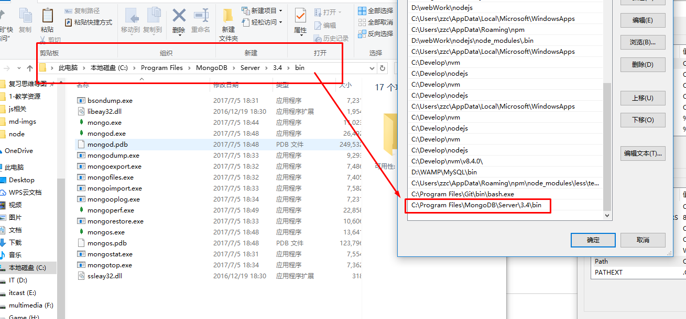

## MongoDB

###MongoDB 介绍

>  MongoDB是一个用json（bson）格式存储的数据库

###统一一下概念

> 一个mangoDB有可以放多个数据库
>
> 数据库里面有数据表（这里叫做集合）
>
> 数据表里面又有很多键值对，也就是真正的数据（这里叫文档，json格式的）
>
> 这里存储的json格式数据叫做bson（json的子集）

###为什么学习node选择 MongoDB?

- 学习成本较低
- 和 Node.js 结合最好,  对 javascript 兼容较好

###官网链接:

- [英文官网 -  https://www.mongodb.com/](https://www.mongodb.com/)
- [中文官网 - https://www.mongodb.com/cn](https://www.mongodb.com/cn)
- [菜鸟教程 - http://www.runoob.com/mongodb/mongodb-tutorial.html](http://www.runoob.com/mongodb/mongodb-tutorial.html)

###安装:

#####★ win 安装:   ( 推荐下载安装 )

- 下载安装; （可以选默认安装，如果手动安装不要在中文路径下）
- 下载:[下载官网](https://www.mongodb.com/cn)

#####★ mac 安装 :     ( 推荐在线安装 )

1. #####安装: [home brew](https://brew.sh/)

   ```js
   /usr/bin/ruby -e "$(curl -fsSL https://raw.githubusercontent.com/Homebrew/install/master/install)"
   ```

2. 测试 brew 安装是否成功: 

   ```
   brew -v
   ```

3. 更新 brew

   ```js
   brew update
   ```

4. 安装 MongoDB

   ```js
   brew install mongodb --with-openssl
   ```

5. 检查: 

   ```js
   mongo --version

   //显示如下代表成功:
   MongoDB shell version v3.4.7
   ......
   ```

###启动、连接 mongodb 服务器: ( Windows版 )

- 都是英文文档，知道你看不懂，还是别看了。

> [win-mongodb 使用](https://docs.mongodb.com/manual/tutorial/install-mongodb-on-windows/)
>
> [mac-mongodb 使用](https://docs.mongodb.com/manual/tutorial/install-mongodb-on-os-x/?_ga=2.176735077.1185746849.1509691062-1923881747.1503743759#run-mongodb)

####  ### 非常关键的点

**安装在哪个路径，哪个路径就要用`data/db/`这样层级的文件目录**

- 推荐放在c盘，在c盘创建一个data/db/的目录
- 然后配一个path用户变量（见图例）



 ##### 启动数据库服务器:

> 目录创好了就打开cmd或者bash或者powerShell链接一下吧

```js
————————tips
  如果使用这个路径 ` c:\data\db\ `,就可以直接链接,
- 在启动的时候，可以通过 --dbpath 指定db目录
$ mongod --dbpath D:\mongo-data

-  如果不加--dbpath, mongod会看你是在哪装的，就去哪个盘下面找`\data\db\ ` 文件夹
```
#### 开始你的芒果之旅吧

1. 在命令行输入 **mongod** 启动服务  (注意 :  不是 mongodb 也不是 mongo)

   ```js
   > mongod                             // mac 下 要使用 sudo mongod 
   // 如果出现瞎买这句话才算 OK    
   > ....  waiting for connections on port 27017
   ```

2. **[ 切记 ] **停止服务：按 ctr + c，`不要直接通过关闭 cmd 窗口的方式来关闭`

   > 如果你真的作大死了

   - 任务管理器 关闭进程
   - 找到 `mongod.lock` 删掉

3. 启动之后把这个命令窗口最小化

4. 再开启一个新的窗口进行数据库操作

###开启、连接 mongodb 服务器: (  Mac 版)

> windows用户跳过这个部分

> [win-mongodb 使用](https://docs.mongodb.com/manual/tutorial/install-mongodb-on-windows/)
>
> [mac-mongodb 使用](https://docs.mongodb.com/manual/tutorial/install-mongodb-on-os-x/?_ga=2.176735077.1185746849.1509691062-1923881747.1503743759#run-mongodb)

  ##### (一)、启动数据库 服务器:

- 1. 创建 `/data/db`  目录 ;  

  ```js
  //代码执行
  sudo mkdir -p /data/db   //sudo 提高权限    目录在 Finder/左侧设备/XXX/Machintosh/data/db
  ```

- 2. 开启数据库服务器:  

   ```js
   // 开启
   sudo mongod 

   else ....
   ------------ 指定路径分割线 -----------
   // 指定路径开启
   1. 创建一个目录: mongodb-data
   2. sudo mongod --dbpath [把文件夹直接拖进来]

   //开启成功:--- 正确分割线-----------
    : waiting for connections on port 27017
   --------------错误分割线-----------
   //千万要注意: 一定要正常退出,,不要直接 X 掉终端,,没用的,,下次开开启开不了,用也用不了
   // 如果报错已经在 use : addr already use, 说明就是 
   // 查看当前进程
   ps -aef | grep mongo
   //显示
   501 10576 6955 0 5:44下午 ttys002   0:00.0 grep mongo
   //杀掉进程: (不要杀 PID 是1的--那是关机)
   sudo kill 6955 
   // 杀到后,找到 MacintoshHD 的 data/db 里面全部删掉,再次重启:
   sudo mongod 即可
   ```

- 3. **[ 切记 ]**停止服务：

   - 按 cmd + c，不要直接通过关闭终端 窗口的方式来关闭

   ​

   #####(二)、连接数据库 服务器:

- 再打开一个终端窗口

- 执行`mongo`命令,**连接数据库服务器**

- mongo 命令,默认去连接本机上的 MongoDB 服务实例: `127.0.0.1:27017`    {一定要记住这个端口号}

- 也可以通过下面的命令,指定连接的主机名和端口号:

   ```js
   mongo --host 127.0.0.1 --port 27017
   ```

   > 提示：如果提示 “无法连接主机”，请检查你的 MongoDB 数据服务实例是否开启。


​        (三)、操作数据库 服务器: {见基本操作命令}


##### 小结:

1. #####开启数据库服务器: `mongod`  / `sudo mongod` 
2. #####连接....................: `mongo`
3. #####关闭....................: `Ctr+C`


## 基本操作命令

- #####1. 查看服务器里所有的数据库  :  `show dbs`

  ```bash
  > show dbs
  # admin       0.000GB
  # local       0.000GB
  ```

- #####2.  切换 / 创建数据库 : `use 数据库名称`

  - 创了库不写表，这个库会被自动删掉


  - (简单了解即可) 连接到数据库之后，默认有一个变量叫做：db，终端默认把 db 赋值给了 test

  - ```bash
    > use  zzc
    # switched to db admin
    ```

- #####3.  查看当前所处的数据库 : `db`

  - ```powershell
    > db
    # admin    //(如果没有指定具体的数据库就会返回一个测试的: test)
    ```

-  #####4. 插入操作

   >  创建集合并插入`一条` 数据 : `db. 集合名称. insertOne ( 数据文档 )`
   >
   >  > db.表名.insertOne({})
   >
   >  创建集合并插入`多条` 数据 : `db. 集合名称. insertMany ( 数据文档 )`
   >
   >  > db.表名.insertOne([{},{},{}])

   - 如果没有集合就创建,
   - 如果有集合,就直接插入数据

   ```bash
   # 1. 插入一条 
   db.news.insertOne({id:1, name:"zzc"})
   db.news.insertOne({id:1, title:"zzc", url:"http://www.github.com/zzc5464", text:"myhub"})
   # WriteResult({ "nInserted" : 1 })   // insert 成功

   # 2. 插入多条  
   db.news01.insertMany([
     { title: "张三",  url: 'www.zhangsan.com', text:'我是张三,谁与我争雄'},
     { title: "李四",  url: 'www.lisi.com', text:'我是李四,我不爱女人,只爱妖妖'},
     { title: "王五",  url: 'www.wangwu.com', text:'我住隔壁,我姓王'}
   ])
   # 结果如下
   {                                  // 插入多条成功
   	"acknowledged" : true,
   	"insertedIds" : [
   		ObjectId("59fcc3f96208a88400da6d6e"),
   		ObjectId("59fcc3f96208a88400da6d6f"),
   		ObjectId("59fcc3f96208a88400da6d70")
   	]
   }
   ```
   #####5. 查看当前数据库中所有的集合 : ` show collections`

   ```bash
   > show collections
   aaa
   news
   ```

   #####6. 查询该集合中的所有数据 :  `db.表名.find()`   

   - 可以通过 `db.集合名称.find().pretty()` 美化输出格式    (如果属性少就不会显示美化格式)
   - 默认是查询所有，可以通过：`db.集合名称.find({查询条件})` 按条件查询集合中的数据

   #####7. 根据条件查询该集合某一条/多条数据:  `db. 集合. find(条件) `   [具体查询]

   - 条件过滤数据
   - 条件语法(写过滤的时候都要带上$)

   | gt    | lt   | e    | ne   |
   | ----- | ---- | ---- | ---- |
   | 大于多少的 | 小于   | 等于   | 不等于  |

   ```bash
   # 例子
   db.girl.find({age:{$gt:18}});
   # 查找girl表中年龄大于18岁的
   # 结果可能如下（因为每个人的数据不一样）
   { "_id" : ObjectId("59fcb97f6208a88400da6d65"), "name" : "nana", "age" : 18 }
   { "_id" : ObjectId("59fcbee26208a88400da6d69"), "nage" : "meimei", "age" : 19 }
   ```

   - gt/lt和e/ne可以连写

   > gte ---> 大于等于
   >
   > lte ---> 小于等于

   #####8. 更新指定集合数据 : `db.集合名称.update({更新条件},{$set:{要更新的字段}})`

   - 要修改多个要在后面加 ,`{multi:true}`


```bash
db.man.update({age:{$gte:18}},{$set:{sex:'女'}},{multi:true});
# man表中年龄大于等于18岁的性别全都改成了女
# 出现 WriteResult开头的`代表更新成功`
```

#####	9. `删除集合的某条数据 : db.集合名称.remove({删除条件})`

```bash
db.test.remove({name:'石家庄人'})
# 杀死那个石家庄人
```

#####	10. 删除表 : `db.集合名称.drop() `

```bash
db.test.drop()
# 这个表没了
```

- 参考文档：https://docs.mongodb.com/manual/crud/
- 参考文档:http://www.runoob.com/mongodb/mongodb-update.html (推荐)

## Node.js 操作 MongoDB — 使用 MongoDB 驱动器

> 这个mongodb 是 nodeJs的一个模块
>
> 帮助 nodejs 来操作 mongo 数据库的,虽然名字一样,但是实质不一样
>
> 就是个包

1. Quick Start 参考文档:

   - [MongoDB - Quick Start](http://mongodb.github.io/node-mongodb-native/2.2/quick-start/quick-start/)   —>找: Connect to MongoDB
   - [npmj- Quick Start](https://www.npmjs.com/package/mongodb#connecting-to-mongodb)   —> 找: Connecting to MongoDB
   - [菜鸟教程](http://www.runoob.com/mongodb/mongodb-remove.html)

2. 安装: 

   ```js
   npm init -y   //初始化包配置文件
   npm i mongodb -SD   //安装
   ```

3. 前提:**开启数据库服务器** :  终端开启`MongoDB 服务器` : 执行:`mongod` / `mongod -dbpath 新路径 `     

   - 如果是 mac 记得加 `sudo`: `sudo mongod`
   - 检查是否操作成功: 可以打开 `mongo 查看`

4. CRUD [增删改查]


###CRUD (增删改查)

0. 连接数据库服务器:

      ```js
      //1. 加载 mongodb
      var mongodb = require('mongodb')

      //2. 获取一个连接数据库的对象 MongoClient 
      var  MongoClient = mongodb.MongoClient;

      //3. 连接字符串   连接到数据库进程 数据db01里
      // var url = 'http://127.0.0.1....'
      var url = 'mongodb://127.0.0.1:27017/db01'

      //4. 开始连接
      /// [注意]一定要注意,终端开启数据库服务器 sudo mongod
      MongoClient.connect(url,function (err,db) {
        
        if (err) {
          throw err
        }
        console.log('连接上了数据库');

        //5. 一定要关闭
        db.close()
      });
      ```


### 增

- 插入单条数据

>  使用方法: **db . collection(XX) . insertOne ( { 数据 } , callback(err,result) ) **

>  insert( {数据 }, callback )  — 已经废弃

> tips:
>
> 插入单条数据
>
>  [注意1] 插入数据是异步的  所以要有个回调函数
>
>  [注意2] insert() 在 3.2版本之后,已经慢慢被废弃

   ```js
//db.collection(表名).insertOne(数据对象).回调(err,数据){db.close()}
     db.collection('heros').insertOne({name:'星哥',age:18}, function(err,doc){

       if (err) {
         throw err
       }
       //数据
       console.log(doc)
        //[注意] 取值之后,一定要记得关闭数据库
        db.close()
     })
   ```

   ​

- 插入多条数据

>  使用方法 : 
>
>  db.collection(表名).insertMany([{},{}]).回调(err,数据){db.close()}

```js
  //2. 插入多条数据
  // [注意] 插入数据是异步的
  // 所以要有个回调函数
  db.collection('heros').insertMany([
    {name:'虎哥',age:80},
    {name:'达达',age:18},
    {name:'香香',age:19},
  ], function(err,doc){

    if (err) {
      throw err
    }
    console.log(doc)
     //[注意] 取值之后,一定要记得关闭数据库
     db.close()
  })
```

### 查

1. 查询全部数据

   >db.collection('表名').find ( { 条件 } ) . toArray ( callback(err,docs) )
   >
   >返回一个数组

   ```js
   // 获取数据
     db.collection('heros').find().toArray(function (err,doc) {
      
       if (err) {
         throw err
       }
       // doc 是一个数据集合
       console.log(doc)

       db.close()
     })
   })
   ```

2. 查询单条数据

   > db.collection('表名').findOne( { 条件 },callback(err,docs){} )
   >
   > 返回一个对象

   ```js
   // 查询单条数据
     db.collection('heros').findOne({age:16},function (err,doc) {
       if (err) {
         throw err
       }
       console.log(doc)
        // 异步里关闭数据库
        db.close()
     })
   ```

   ​

   ### 改

3. 更新数据

   > db.collection('表名').updateOne({条件},{$set:{更新字段}},function (err,doc){})
   >
   > 更新多条: **updateMany**

   - 如果只跟新一条是用$ set, 如果工作中的编辑页面是要获取所有的信息都要更新一遍的

     所以,直接写对象即可,不用$ set 了

   ```js
   //5. 更新数据
     // update(参数1,参数2,回调)
     db.collection('heros').updateOne({age:16},{$set:{name:'丹丹'}},function (err,doc) {
       if (err) {
         throw err
       }

       console.log(doc)

       console.log('ok')
     
       db.close()
     })
   ```

   ### 删

   >db.collection('名').deleteOne({条件},function (err,doc) {})
   >
   >db.collection('名').deleteMany ({条件},function (err,doc) {})

   ```js

     //删除多条 deleteMany()
     db.collection('heros').deleteOne({age:16},function (err,doc) {
       if (err) {
         throw err
       }
       
       console.log('删除成功')

       //6. 关闭数据库
       db.close();
     })
   ```

