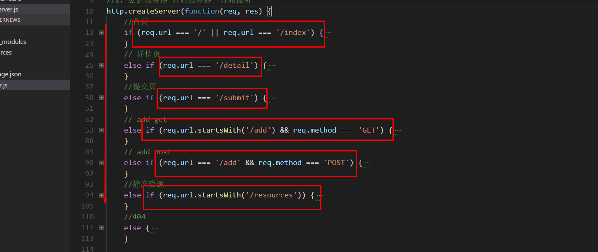

# 中间件

## 中间件是什么?

- 是一个函数


- 把一个按照顺序执行的大请求，`拆分`成一个个小小的函数来处理 ; 

## 中间件干嘛的?

- 最早的请求过来的时候,是怎么处理请求的?
  - 写一个大的功能，在代码里面一路往下走



- 中间件就是把里面的不同功能写进不同的函数里面
- 类似于模块化开发

## 概念

> 中间件特别像自来水厂


- 从取水到用户的直接实现就是原来的写法
- 中间件就将大实现拆分成一个个小的功能实现
- 每一关就是一个中间件, 中间件有三个参数 req,res,next,  (错误是四个参数)
- 每一次中间件来请求的时候,要么, `next 下一次处理`,要么就是 `end 结束`

见代码:

```js
//基于express的路由
var app = require('express');
app.get('/',function(req,res){
  res.send();//因为响应了，所以不用next
})
app.get('/index',function(req,res){
  res.send();
})
```

> 代码中`get函数的回调`其实就是中间件，带有res和req
>
> 没有next，因为写了send结束

- 如果有需求要执行完一个中间件继续往下执行就要用next

```js
app.get('/index',function(req,res,next){
  next();
})
//执行完这个中间件会继续往下执行
```

- 像路由一般都会在最后配置一个404的响应，叫做兜底
- 这种中间件本来就是作为结束的，所以不能用next

```js
app.use('/',function(req,res){
  //这里用了use，代表以/开头的所有无法匹配的路由
  res.send('404');
})
```

## 中间件可以做什么

- 执行中间键中的代码。
- 修改请求和响应对象。
- 终结请求-响应循环。
- 调用堆栈中的下一个中间件。

1. 这个函数通常有 3 个参数，`req、res、next`

2. 错误处理中间件有 4 个参数，`err, req, res, next`

### 如何判断一个中间件会不会被执行

- 只看两点

1. 前一个中间件有没有被调用 `next()函数`  只要调用了 next() 函数, 那么后面的中间件有机会执行
2. 要看这个中间件注册路由时,`路由是否匹配`当前用户请求的路由,如果匹配才会执行

### 特点

1. 从上往下依次执行。判断是否匹配路由 ? "执行" : "去找下一个"。
2. 一个中间件，要么end/send结束，要么next跳到下一个。
3. 全都不匹配，写一个兜底的404。

```js
//1. 加载 express
var express = require('express');

//2. 
var app = express();

//3. 注册
app.get('/index',function (req,res) {
  
  res.send('index')
})

// Cannot GET /
// 就是因为有个兜底的中间件
app.use('/',function(req,res){
  
  res.send('404')
})

//开启服务器
app.listen(8080)
```


# express 中的中间件分类

1. 应用程序级中间件

   - 通过 app 对象来挂载的中间件
   - app.use()、app.get()、app.post()、...

2. 路由级中间件

   - 通过 router 对象来挂载的中间件
   - router.use()、router.get()、router.post()、......

3. 错误处理中间件

   - 必须写4个参数 err、req、res、next
   - 错误处理中间件一般定义在所有中间件的最后
   - 在错误处理中间件中如果不调用 next(err), 那么必须要结束请求。一般错误处理中间件就是最后一个中间件了，所以需要 res.end()

4. 内置中间件

   - express.static

5. 第三方中间件

   - body-parser 等安装的第三方中间件

   - [第三方中间件列表-中文](http://www.expressjs.com.cn/resources/middleware.html)

   - [第三方中间件列表-英文](http://expressjs.com/en/resources/middleware.html)

     ​

### 模拟 body-parser

```js
var querystring = require('querystring');

module.exports = function (req,res,next) {

  var bufferArr = [];
  req.on('data',function (chunk) {
    bufferArr.push(chunk);
  })
  req.on('end',function () {
    var buffer = Buffer.concat(bufferArr);
    buffer = buffer.toString();

    buffer = querystring.parse(buffer);

    req.body = buffer;


    next();

  })
}
```


