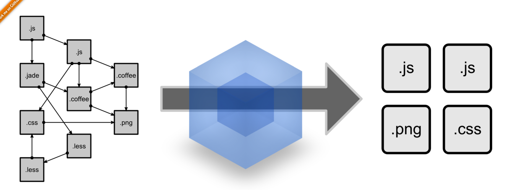
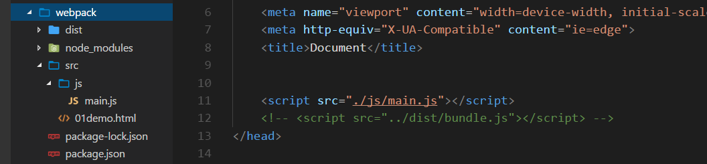
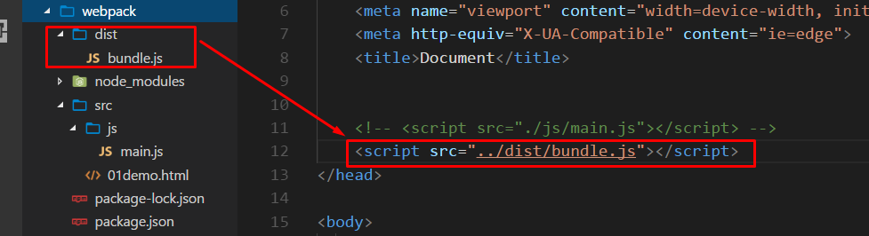
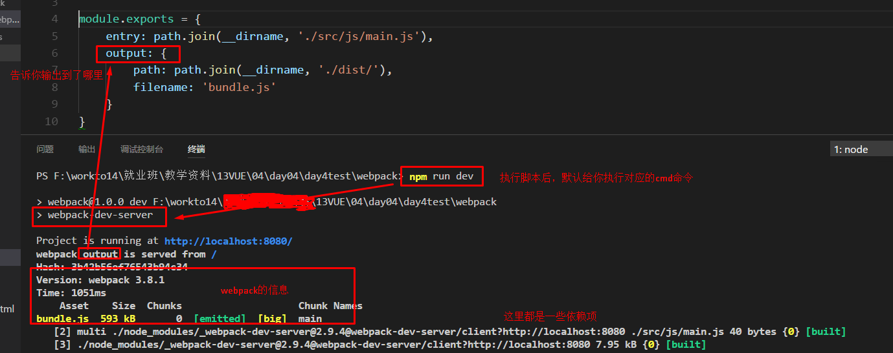

# webpack



## webpack是什么？

[官网](http://webpack.github.io/)

> 现在的前端项目包含了各种各样的静态文件，路径杂乱，非常不方便管理。
>
> 非常多的js、css文件会造成很多的请求，增加服务器的压力。
>
> 比如gulp，就是处理压缩、混淆文件的事情。
>
> gulp更像一个服务，面向某一个任务。
>
> webpack可以说是一个增强版，面向一整个项目进行打包。

## 作用

1. 压缩、混淆代码的事情都全能做。
2. 让项目变成模块化开发，省的去处理复杂的文件路径问题。

## 如何使用

### 安装

1. **全局安装**  `npm i webpack -g`
2. **项目安装** `npm i webpack -SD` 

- 基本语法:`webpack 要打包文件的路径  打包好文件输出的路径 `

### 例子



> 1. 在webpack项目中入口文件`main.js`中需要模块化引入`jquery`
> 2. 要通过`import $ from jquery` 导入jq文件
> 3. 但是import这个语法是现在浏览器不支持的，(ES6的语法现在浏览器并不是所有都支持)
> 4. 那么就要通过webpack来解析成可以支持的代码

```js
//比如在 src/js中的入口文件 main.js 中引入 jquery
import $ from 'jquery'
//要导出到dist/js/bundle.js中
```

> 5. (此时命令行路径在webpack下) 通过命令行`webpack ./src/js/main.js ./dist/js/bundle.js`
> 6. 那在`01demo.html`中引入的文件路径就要改成`dist/js/bundle.js` 



## webpack 的配置文件

> 就是给webpack的一些配置项，会写在`webpack.config.js` 文件中，必须在项目根目录

### 实现简易的打包命令功能

> 原来的打包命令是`webpack ./src/js/main.js ./dist/js/bundle.js` ，可以通过配置简化操作，直接使用`webpack` 就可以编译

```js
//webpack.config.js
var path = require('path');
module.exports = {
    entry: path.join(__dirname, './src/js/main.js'),
    output: {
        path: path.join(__dirname, './dist/'),//输出文件的路径
        filename: 'bundle.js'//输出文件的名字
    }
}
```

1. webpack基于node，所以使用`module.exports` 导出 以及 `require` 导入
2. 当在cmd使用`webpack` 命令的时候，他会默认去找是否后面还有接两个地址的参数，没有就去`webpack.config.js` 中找，然后根据entry和output参数进行文件的编译
3. `entry` 指定的是需编译文件的路径，`output` 指定的是输出文件的路径

### 实时刷新

#### **webpack --watch**

> 如果每改一行代码，就要`webpack` 一次会shi掉的，所以webpack提供了实时刷新的命令
>
> `webpack --watch` 执行之后会不断的进行编译，不断更改页面

#### webpack-dev-server

- 安装：`npm i webpack-dev-server -D` 第三方的插件，只用在开发阶段

- 他依赖于`webpack` 包，所以再安装一个webpack包

- `npm i webpack -D`

- 他提供的功能不仅仅是重新打包


**使用:**

- 安装好后，通过cmd执行脚本`webpack-dev-server`

- 一般都会报错，因为要先配置npm脚本来执行


> package.json中的`script ` 可以配置命令行脚本，其实就是简化。把左边的值当成一个变量，执行了这个变量相当于执行了右边的脚本
>
> 配置完成后通过`npm run ` + `你配置的命令` 执行，除了变量是`start` 的情况，其他命令都要加run。

- 执行后就可以通过`localhost:8080` 查看它给你打开的服务器了
- 并且直接打包

**看看它都给你做了些啥**



> **注意**这个打包工具将`bundle.js`打包到了项目/ 目录下，所以在html中引入js文件的时候要更改路径为
>
> ```html
> <script src="/bundle.js"></script>
> ```
>
> webpack-dev-server会将打包好的文件放到内存中提高效率，再去更改js文件会有时时刷新的效果。
>
> **它和webpack打包的文件没有关系**。

#### wds的其他配置项

1. 这是推荐的一种配置，写在package.json中

```json
"scripts": {
        "test": "echo \"Error: no test specified\" && exit 1",
        "dev": "webpack-dev-server --hot --open --contentBase src --port 3000"
    },
```

> `--hot`: 指定的话，只编译更改的代码，否则默认编译所有的文件，这样效率更高。
>
> `--open`: 服务器启动后自动打开，偷懒美滋滋。
>
> `--contentBase src(路径)` : 指定默认打开的路径，原来打开在`端口/`路径下
>
> `--port 3000` : 指定端口号

2. 写在webpack.config.js文件中
   - 首先你要引入`webpack`模块
   - 添加devServer，配置参数
   - 添加plugins配置

```js
var path = require('path');
// 1. 引入webpack模块
var webpack = require('webpack');

module.exports = {
    entry: path.join(__dirname, './src/js/main.js'),
    output: {
        path: path.join(__dirname, './dist/'),
        filename: 'bundle.js'
    },
  //2.  配置devServer
    devServer: { // 第二种配置 webpack-dev-server 指令的方式
        //  --open --contentBase src --port 3000 --hot
        open: true, // 打包完毕后自动打开浏览器
        contentBase: 'src', // 指定托管运行的根目录
        port: 3000, // 指定要启动的默认端口号
        hot: true // 启用热更新
    },
 
    plugins: [ // 插件有关的都要写在这里
       // 3. 配置hot需要的插件
        new webpack.HotModuleReplacementPlugin(), // 此处的 HotModuleReplacementPlugin 要配合 devServer中的 hot结合使用，否则报错
    ]
}
```

### html-webpack-plugin插件

> 作用：将htm页面也托管到内存中去
>
> 安装: `npm i html-webpack-plugin -D`
>
> 引入：`var htmlWebpackPlugin = 'html-webpack-plugin'`
>
> 配置：在plugins里面配置htmlWebpackPlugin

```js
plugins:[
  //使用插件一般都要new
  new htmlWebpackPlugin({
    //指定把哪个html放进内存中
    template:path.join(__dirname,'src/index.html'),
    //放到内存的时候，名字叫什么
    filename:'index.html'
  })
]
```


