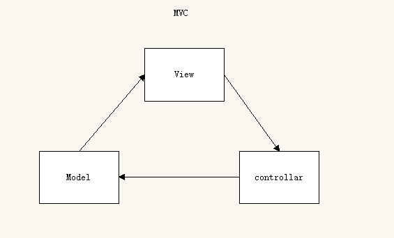
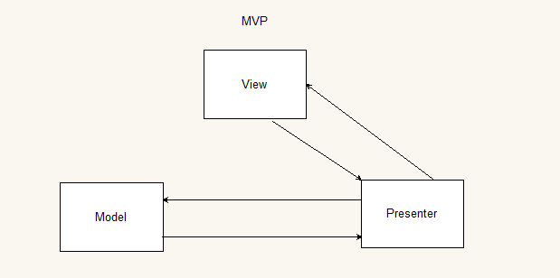

# 框架的基本概念

## 框架与库的区别

- 框架，就是完型填空。对项目侵入大，更换框架基本等于从头再来。
- 库，给你提供了整套api，但是具体的功能还是要自己实现。

## 框架的由来

> 最早是c语言提出的
>
> 因为代码都写在一起非常难以管理
>
> 不好分工

#### mvc思想

- 由整个项目来看：view层面就是前端、model为数据库、controllar为服务器
- 由前端来看：view则是html，model则是获取来的数据、controllar则是处理数据的方法

> MVC的思想：view层从Model中取数据，View交互回来的数据交给controllar处理，controllar处理完交给数据库。
>
> 但是这样的设计模式耦合太严重。
>
> 于是就诞生了MVP思想

#### MVP思想

> Presenter扮演的是指挥者的角色，
>
> 数据的处理以及视图层交互的数据不再直接联系
>
> 而是都通过Presenter来处理
>
> Presenter处理的逻辑都是自己写的
>
> 每次写项目都要自己写，还是不够舒服
>
> 于是就诞生了MVVM思想

#### MVVM思想

> 数据和视图层面的交互都是一样的
>
> 关键就是指挥者的角色变了
>
> 指挥者成了第三方来处理
>
> 我们只负责数据
>
> 这样开发就非常高效了