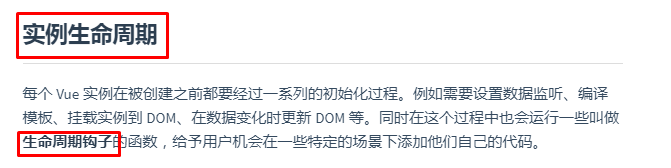
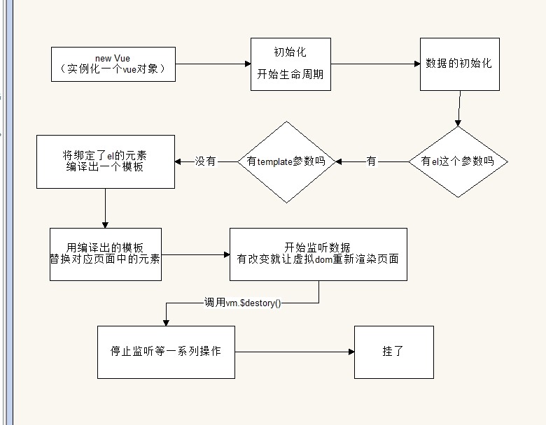
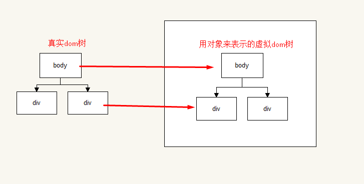

# 实例的生命周期



- 需要知道的就两点
  1. 生命周期的过程
  2. 钩子是什么？

## 生命周期



> 1. 首先new了一个实例出来	`var vm = new Vue()`
> 2. 内部开始初始化生命周期
> 3. 内部初始化数据（到这部的时候就可以拿到vm.data中的数据了
> 4. 查看有没有el这个参数（一般情况下都有的）
> 5. 查看有没有template参数（这里走没有的情况）
> 6. 把el绑定的那个元素编译成一个模板


> 7. 用这个正确的模板替换掉本来的html结构（这也是页面为什么会闪现的原因
> 8. 开始一个稳定期，一直监听数据有没有改动，有的话就用虚拟dom重新渲染页面
>    - 虚拟dom又是什么？



>  - ​
>    - 和页面中的真实dom是一一对应的关系
>    - 因为如果数据一改动就要重新渲染页面的话太耗性能了，用虚拟dom来跟真实dom进行比对，发现不同才会去更改部分内容。
>
>  9. 当有人去调用vm.$destory()方法的时候触发，卸载所有的事件监听、子组建
>  10. 真的没了

### 小结论

+ 一般当我们写好一个vue实例并在浏览器查看的时候，就已经进行到vue生命周期的循环阶段了，也就是**第8步**
+ 其他部分的内容都是vue组件自行解决的，也没人闲的蛋疼去$destory实例
+ 在**第3步**的时候会将data，methods里面的键都通过`Object.defineProperty()`挂到vm实例上去,这也是为什么可以在里面用this找到vm的原因

## 钩子函数

> 其实就是事件触发函数，等同于js的on事件们
>
> `当。。。的时候触发`
>
> vue的事件触发（钩子）函数一共有4组，每组2个

```js
		var vm = new Vue({
            el: '#app',
            data: {
                msg: '123'
            },
            //1. 初始化数据系列
            beforeCreate() {
                alert('初始化数据');
            },
            created() {
                this.msg = '456';
                alert('数据加载好了');
            },
            //2. 挂载渲染好的模板到页面上系列
            beforeMount() {
                alert('马上要挂载上去了')
            },
            mounted() {
                alert('已经挂载上去了')
            },
            //3. 更新数据系列
            beforeUpdate() {
                alert('更新数据之前')
            },
            updated() {
                alert('更新后的');
            },
            //4. 被杀死系列
            beforeDestroy() {
                alert('走了')
            },
            destroyed() {
                alert('我真的走了')
            }
        })
```

- 最常用的是created，就是在数据刚创建好的时候。常在这里渲染最开始的页面数。
- 钩子函数不能使用箭头函数，否则this不会指向vm实例


