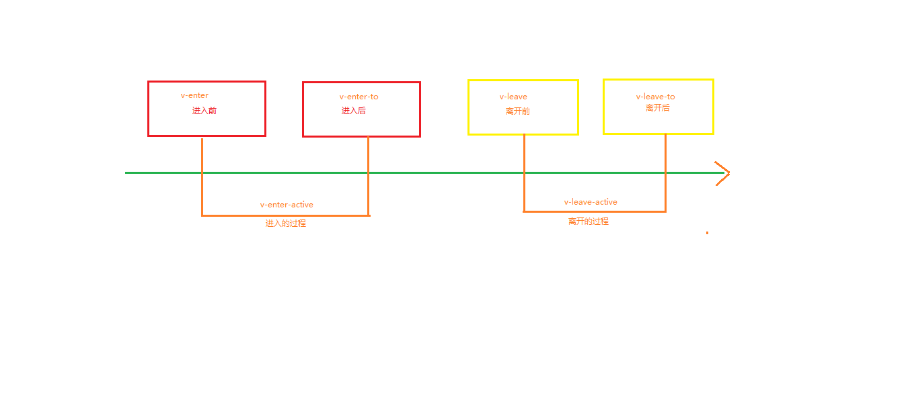

# vue过渡动画

> vue将动画分成六个部分



> 动画从`v-enter`开始执行，到`v-leave-to`完成
>
> 一共有三种定义过渡动画的方式

## 一、类名设置动画

> 对应上图一共有2组---->6个动画类
>
> 动画进入: `.v-enter--->.v-enter-active--->.v-enter-to`
>
> 动画离开: `.v-leave--->.v-leave-active--->v-leave-to`

```css
        /* v-可以替换成任意的名字，如果不改默认是找v-开头的类 */
		.zzc-enter {
            margin-left: -200px;
        }
        
        .zzc-enter-to {
            margin-left: 0;
        }
        /*一般active都是写动画的*/
        .zzc-enter-active {
            transition: all 1s linear;
        }
        
        .zzc-leave {
            margin-left: 0;
        }
        
        .zzc-leave-to {
            margin-left: 200px;
        }
        
        .zzc-leave-active {
            transition: 1s all;
        }
```

- 定义了以上的类还没完
- 还要在需要做动画的元素外面包裹一层`<transition></transition>`
- name属性可以指定类名的前缀

```html
        <transition name='zzc'>
            <div id="box" v-if='isShow'></div>
        </transition>
```

#### 动画的形式

- 点击按钮切换
  1. 点击的时候更改`isShow`的值
  2. 给`mounted`钩子函数定义isShow为true

```html
    <div id='app'>
        <button @click='isShow=!isShow'>点我啊</button>
        <transition name='zzc'>
            <div id="box" v-if='isShow'></div>
        </transition>
    </div>
    <script src='./node_modules/vue/dist/vue.js'></script>
    <script>
        var vm = new Vue({
            el: '#app',
            data: {
                isShow: false
            },
            methods: {},
            mounted() {
                this.isShow = true;
            }
        })
    </script>
```

## 二、通过属性设置动画

> 1. enter-active-class=""
> 2. leave-active-class=""
>
> 给transition标签设置这两个属性属性，可以接收做动画的类名
>
> 一般会配合animate.css做动画
>
> 下载animate.css
>
> 1.  `npm i animate.css -S`  import导入
> 2. `<link rel="stylesheet" href="./node_modules/animate.css/animate.css">`

```html
        <transition enter-active-class="animated lightSpeedIn"
        leave-active-class="animated rotateOut">
            <div class="box" v-if="isShow"></div>
        </transition>
```

- 这种方式比较简单，效果又很好
- 推荐使用

## 三、js钩子函数实现

> vue提供了8个钩子函数：

```js
//在methods中定义8个钩子函数
//从进入前，进入，进入后，进入取消
//到离开前，离开，离开后，离开动画取消
methods:{
    beforeEnter(el){
                    el.style.marginLeft = "200px";
                    console.log("beforeEnter执行了")
    },
    enter(el){
             console.log("enter执行了")
    },
    afterEnter(){
        console.log("afterEnter执行了")
    },
    enterCancelled(){
        console.log("enterCancelled执行了")
    },
    beforeLeave(){
        console.log("beforeLeave执行了")
    },
    leave(){
        console.log("leave执行了")
    },
    afterLeave(){
        console.log("afterLeave执行了")
    },
    leaveCancelled(){
        console.log("leaveCancelled执行了")
        
    }
}
```

- 还要在`transition` 标签中定义8个属性

```html
<transition 
    v-on:before-enter="beforeEnter" // 也可以写成@before-enter的形式
    v-on:enter="enter"
    v-on:after-enter="afterEnter"
    v-on:enter-cancelled="enterCancelled"
    v-on:before-leave="beforeLeave"
    v-on:leave="leave"
    v-on:after-leave="afterLeave"
    v-on:leave-cancelled="leaveCancelled"
>
    <div class="box" v-if="isShow"></div>
</transition>
```

> 不过动画结束的钩子一般不用的

## 总结

- 首先要设置enter的初始位置，和leave的结束位置。
- 将需要做动画的元素包裹到`<transition></transition>` 中
- 要有触发动画的函数，比如mouted加载完，或者点击某个按钮
- v-if不是必须的