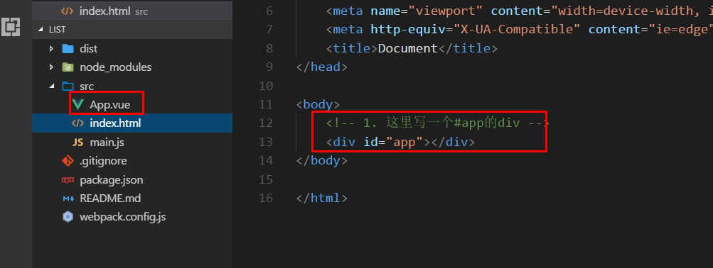

# 单文件组件

## 单文件组件是什么

- 原有的组件写法

```js
Vue.component({
  template:'#home',
  data(){}
})
```

> 虽然有将单个元素的具体功能以及结构分离出来，也可以复用。
>
> 但我们更希望，一个组件就是一个文件，而且里面直接就能够包含html、css、js。
>
> 单文件组件就是让一个项目更加解耦，更加易于分工的东西。

## 如何使用

- 单文件页面基于webpack，因为`.vue` 文件必须要经过编译。
- 从网上随便下一个webpack模板

`https://github.com/avakpan/vue-template` 

- 项目结构



1. 在`index.html`写入一个带`#app的div`
2. 编写单页面的vue组件
   - template代表html
   - script代表js
   - style代表css

```js
// App.vue
<template>
  <div>
    <h1>外层组件</h1>
  </div>
</template>

<script>
export default {
  // 2.  书写单文件组件
  data(){
    return {
      msg:'外层组件'
    }
  }
}
</script>

<style>
h1 {
  height: 30px;
  line-height: 30px;
  background-color: blue;
}
</style>

```

3. `main.js`是组件的入口文件,在这里通过import引入组件

```js
// 引入vue
import Vue from 'vue'
//4. 引入根组件app
import App from './App.vue';

//5. 生成vm实例
var vm = new Vue({
    el: '#app',
    render(createElement) {//固定写法
        
        return createElement(App);
    }
})
```

4. 再下载`vue` `vue-loader`和`vue-template-compiler `要用npm下载
5. 给webpack.config.js配置文件loader


```js
{
  	test:/\.vue$/,
    use:['vue-loader']
}
```

6. 通过`npm start` 可以打开一个最基本的组件。

## 如何使用路由

- 安装

`npm i vue-router -D`

- 在main.js中引入路由

```js
import VueRouter from 'vue-router'
```

- 配置路由,并将要挂载的路由引到main.js页面中

```js
import home from './components/home.vue'
var router = new VueRouter({
  routes:[{
    path:'/home',//路由的url地址
    component:home//路由组件
  }]
})
```

- 在vue实例中关联router

```js
var vm = new Vue({
  router
})
```

- 在app.vue中指定路由显示的位置

```html
<template>
  <div>
  	<router-view></router-view>
  </div>
</template>
```

- 安装vue-router,所有的插件在引入之后都要安装一下

```js
//在import路由模块之后,安装路由
//效果就是让内容生效
Vue.use(VueRouter)
```

> 一开始配置很麻烦，但是之后添加路由，就三个步骤
>
> 1. 创建一个新的.vue文件
> 2. 将这个路由引入到main.js
> 3. 在路由的配置项中加一个路径。

### 最后优化一下

- 在src目录下新建一个文件夹`router/routes.js`
- 将路由相关的配置都放在routes.js中,并`export default`返回一个路由对象
- 再在main.js中引入routes.js

```js
// routes.js
import Vue from 'vue';
import VueRouter from 'vue-router';
Vue.use(VueRouter);

//引入路由
import home from '../components/home.js';

//返回给main.js的对象
export default new VueRouter({
  routes:[
    {
      path:'/home',
      component:home
    }
  ]
})
```

```js
// main.js
import router from './router/routes.js';//新加一条

```


## 使用Vue-cli脚手架

### 使用步骤

1. `npm i vue-cli -g`
2. `vue init webpack 项目名称` 
3. `cd 项目名称`
4. `npm i`
5. `npm start`


