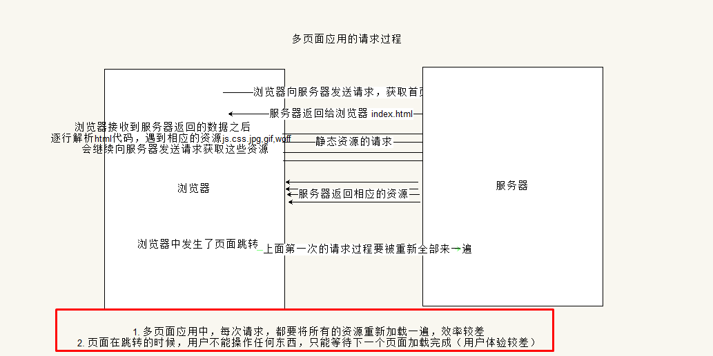
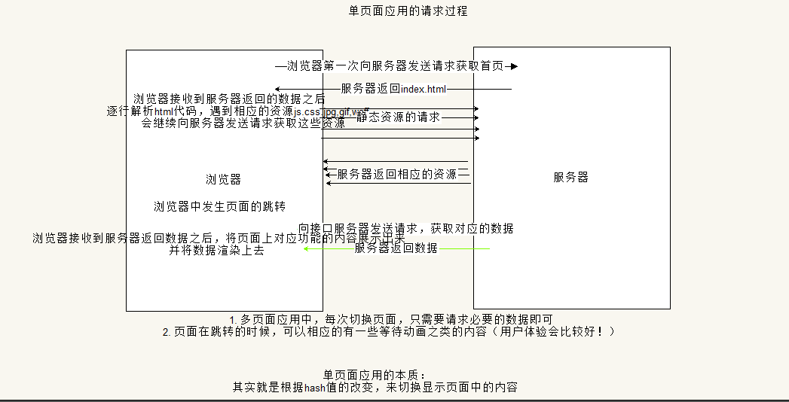

# 单页面应用

### 多页面应用的图例

> 先看传统的多页面应用
>
> 当请求完一个页面，所有资源都加载完毕
>
> 这个时候要去请求一个头尾都一样，只有中间内容变了的页面，又会重新加载所有资源
>
> 并且跳转的时候页面是白的，用户不能操作只能等



### 单页面应用的图例

> 只有一个页面，通过hash改变请求的内容
>
> 缺点是seo不好，不过可以用钱解决
>
> google也在完善能爬hash的爬虫



## 自己实现一个简易的SPA

> 核心的api：
>
> location.hash
>
> window.onhashchange
>
> 当hash值发生改变的时候显示不同的页面

```html
<!DOCTYPE html>
<html lang="en">

<head>
    <meta charset="UTF-8">
    <meta name="viewport" content="width=device-width, initial-scale=1.0">
    <meta http-equiv="X-UA-Compatible" content="ie=edge">
    <title>Document</title>
    <style>
        h1 {
            display: none;
        }
    </style>
</head>

<body>
    <a href="#/index">index</a>
    <a href="#/login">login</a>
    <a href="#/register">register</a>
    <h1 id='index'>首页</h1>
    <h1 id='login'>login</h1>
    <h1 id='register'>register</h1>
    <script src="./node_modules/jquery/dist/jquery.js"></script>
    <script>
        console.log(location.hash);
        $(function() {
            whatHash();
        })
        window.onhashchange = function() {
            whatHash();
        }

        function whatHash() {
            switch (location.hash) {
                case '#/index':
                    $('#index').show().siblings('h1').hide();
                    break;
                case '#/login':
                    $('#login').show().siblings('h1').hide();
                    break;
                case '#/register':
                    $('#register').show().siblings('h1').hide();
                    break;
            }
        }
    </script>
</body>

</html>
```

