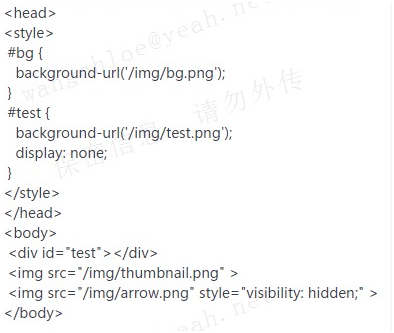

## 1. 以下代码发送了几个请求？



```
1. 只要是img src引用的都会请求；
2. background: url()所属样式如果挂靠在某个元素上，就一定会请求；单独写了这么一个样式并不请求。
答案:3
```

## 2. h5新增的标签

```html
<article>定义外部内容，比如别人博客内容</article> 

<aside>Aside 的内容是独立的内容，但应与文档内容相关。</aside>

<audio src="someaudio.wav">您的浏览器不支持 audio 标签。</audio>

<canvas id="myCanvas" width="200" height="200"></canvas>绘图用的

<datalist></datalist> 
//里面放option标签，输入内容会显示option匹配的内容，模糊查询

<footer></footer>
//网页的底部

<header></header>
//头部

<mark></mark>// 搜索功能使用最好
// 行内元素。不要把 <mark> 元素和  <strong> 元素搞混淆. <strong> 元素用来表示文本在上下文的重要型的， 而 <mark> 元素是用来表示上下文的关联性的.
  
 <nav>网页的导航</nav>
  
 <output></output>
  //计算当前表单所有其他input标签的value值
  
  <progress></progress>
  //显示一个进度条
  
 <ruby>
  漢 <rp>(</rp><rt>Kan</rt><rp>)</rp>
  字 <rp>(</rp><rt>ji</rt><rp>)</rp>
</ruby>
  // 对亚洲文字进行注解用的
  
  <section></section>
  // 就是个div，表示一个大段，不能作为<address> 元素的子节点。
  
  <video><video>
```

